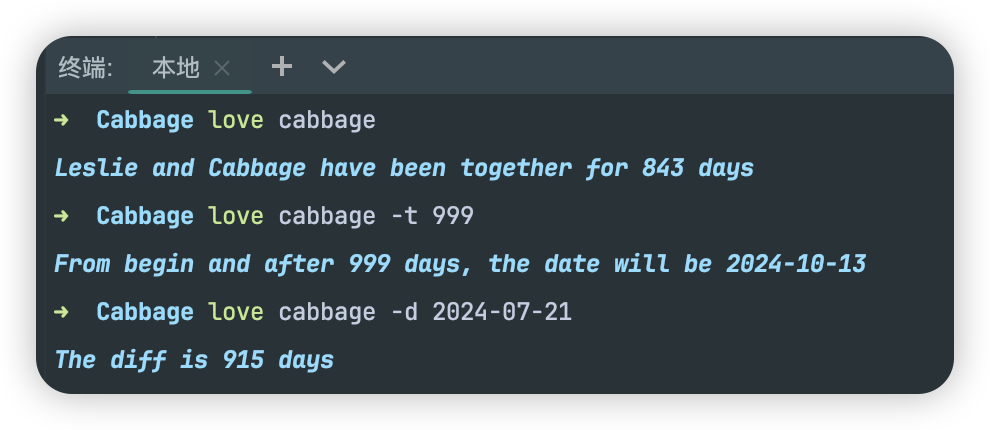

## 一、前期准备

### 背景介绍

#### 什么是npm包

npm包是通过Node包管理器（npm）发布和共享的代码模块，它们也可以被其他开发者在他们的项目中使用。

### 环境准备

- node
- npm账号。可通过[npm官网](https://www.npmjs.com/)注册登录，用于发布到`npm`上
- github账号。可通过[github](https://github.com/)注册登录，用于进行代码管理及发布到`github package`上

## 二、开发

### step1: 初始化

```shell
# 创建文件夹
mkdir Cabbage

# 进入文件夹
cd Cabbage

# npm初始化
npm init
```


### step2: 配置`package.json`

```json lines
{
  "name": "cabbage",
  "description": "Love date calculator",
  "version": "1.0.0",
  "main": "index.js",
  "scripts": {
    "start": "node index.js"
  },
  "bin": {
    // 安装了本包之后，可使用`j`指令去运行`index.js`文件
    "love": "index.js"
  },
  "author": "leslie",
  "license": "ISC"
}
```

### step3: node modules映射

```shell
npm link
```

这样在本地开发的时候，在终端打出`love`的时候，本该去读取全局的`node_modules`，
但`link`后，会读取本文件夹的`node_modules`，实现映射

在最后开发完毕，当然也要解除映射

```shell
# <package name>为包名称，本案例中包名为`cabbage`，应为`npm unlink cabbage`
npm unlink <package name>
```

### step4: 跑通最小实例(MVP)

**目录结构**

```markdown
Cabbage
├── package.json
├── index.js
└── lib
└── core
```

`index.js`

```javascript
console.log('I love cabbage')
```

**测试**

```shell
love
```

报错了，原因是因为输入了`love`，系统会去执行`index.js`文件，但是系统不知道该用什么环境去运行


解决方式: 加上魔法注释

`index.js`

```javascript
#!/usr/bin/env node
console.log('I love cabbage')
```

终端再次输入`love`，跑通


### step5: 安装[commander](https://github.com/tj/commander.js)

```shell
npm i commander
```

`commander`是用来解析指令和参数的，例如`vue-cli`中的`vue create app-demo`，其中`create`就是指令，`app-demo`
就是本次指令的参数。收到不同指令及不同参数，包内执行不同的事情。

### step6: 进入开发

**目录结构**

```markdown
Cabbage
├── package.json
├── index.js
└── lib
└── core
```

#### 指令一: 查看版本号

**当前目录结构**

```markdown
Cabbage
├── package.json
├── index.js
└── lib
└── core
└── version
└── index.js
```

`index.js`

```js
#!/usr/bin/env node
const { Command } = require('commander')
const versionOptions = require('./lib/core/version')

const program = new Command()

// 查看版本号
versionOptions(program)
```

`version/index.js`

```javascript
const versionOptions = (program) => {
  program.version(require('../../../package.json').version)
  program.version(require('../../../package.json').version, '-v')
}

module.exports = versionOptions
```

版本的写法是比较固定的，每个`npm`包几乎都类似如此
其中默认支持`-V`、`--version`, 默认不支持`-v`，如果希望支持，需要自己添加

**测试**

发现没有输出任何东西，是因为系统执行了`index.js`，但是没有解析出`-v`、`-V`等指令，需要主动去解析指令

`index.js`

```javascript
#!/usr/bin/env node
const { Command } = require('commander')
const versionOptions = require('./lib/core/version')

const program = new Command()

// 查看版本号
versionOptions(program)

// 解析指令及参数
program.parse(process.argv)
```

**再次测试**


#### 指令二: 日期计算器

##### 计算在一起的时间

**当前目录结构**

```markdown
Cabbage
│── lib
│ └── core
│ ├── version
│ │ └── index.js
│ └── cabbage
│ ├── index.js
│ └── actions.js
├── index.js
└── package.json
```

`index.js`

```javascript
#!/usr/bin/env node
const { Command } = require('commander')
const versionOptions = require('./lib/core/version')
const cabbageOptions = require('./lib/core/cabbage')

const program = new Command()

// 查看版本号
versionOptions(program)

// 日期计算
cabbageOptions(program)

// 解析指令及参数
program.parse(process.argv)

```

`cabbage/index.js`

```javascript
const { handleCabbage } = require('./action')

const cabbage = (program) => {
  program
    .command('cabbage')
    .description('Love timer')
    .action(handleCabbage)
}

module.exports = cabbage

```

`date/action.js`

```javascript
const handleCabbage = () => {
  const start = new Date('2022-01-18')

  const today = new Date()
  const away = Math.ceil((today - start) / (1000 * 60 * 60 * 24)) - 1
  console.log(`Leslie and Cabbage have been together for ${away} days`)
}

module.exports = {
  handleCabbage
}
```

**测试**

```shell
love cabbage
```


##### 计算纪念日的日期

`cabbage/index.js`

```javascript
const { handleCabbage } = require('./action')

const cabbage = (program) => {
  program
    .command('cabbage')
    .description('Love timer')
    .option('-t, --target <days>', 'Given number of days to calculate the date from start date')
    .action(handleCabbage)
}

module.exports = cabbage
```

`cabbage/action.js`

```javascript
const handleCabbage = (options) => {
  const start = new Date('2022-01-18')

  if (options.target) {
    if (isNaN(options.target)) throw new Error('Target should be a number')
    const targetDate = new Date(start.getTime())
    targetDate.setDate(targetDate.getDate() + Number(options.target))
    console.log(`From begin and after ${options.target} days, the date will be ${targetDate}`)
    return
  }

  const today = new Date()
  const away = Math.ceil((today - start) / (1000 * 60 * 60 * 24)) - 1
  console.log(`Leslie and Cabbage have been together for ${away} days`)
}

module.exports = {
  handleCabbage
}
```

**测试**

```shell
love cabbage -t 999
```


##### 计算时间差值

`cabbage/index.js`

```javascript
const { handleCabbage } = require('./action')

const cabbage = (program) => {
  program
    .command('cabbage')
    .description('Love timer')
    .option('-d, --diff <date>', 'Counting day difference for the given date')
    .option('-t, --target <days>', 'Given number of days to calculate the date from start date')
    .action(handleCabbage)
}

module.exports = cabbage

```

`cabbage/action.js`

```javascript
const handleCabbage = (options) => {
  const start = new Date('2022-01-18')

  if (options.diff) {
    if (!/^\d{4}-\d{2}-\d{2}$/.test(options.diff)) throw new Error('Target should be a date formatted as YYYY-MM-DD')
    const targetDate = new Date(options.diff)
    const away = Math.ceil((targetDate - start) / (1000 * 60 * 60 * 24))
    console.log(`The diff is ${away} days`)
    return
  }

  if (options.target) {
    if (isNaN(options.target)) throw new Error('Target should be a number')
    const targetDate = new Date(start.getTime())
    targetDate.setDate(targetDate.getDate() + Number(options.target))
    console.log(`From begin and after ${options.target} days, the date will be ${targetDate}`)
    return
  }

  const today = new Date()
  const away = Math.ceil((today - start) / (1000 * 60 * 60 * 24)) - 1
  console.log(`Leslie and Cabbage have been together for ${away} days`)
}

module.exports = {
  handleCabbage
}
```

**测试**

```shell
love cabbage -d 2024-07-21
```


##### 优化

避免出现`love cabbage -d <date> -t <number>`这种情况的出现，作出优化

`cabbage/action.js`

```javascript
const handleCabbage = (options) => {
  const start = new Date('2022-01-18')

  if (options.diff && options.target) {
    throw new Error('Only diff or target can be provided, not both')
  }

  if (options.diff) {
    if (!/^\d{4}-\d{2}-\d{2}$/.test(options.diff)) throw new Error('Target should be a date formatted as YYYY-MM-DD')
    const targetDate = new Date(options.diff)
    const away = Math.ceil((targetDate - start) / (1000 * 60 * 60 * 24))
    console.log(`The diff is ${away} days`)
    return
  }

  if (options.target) {
    if (isNaN(options.target)) throw new Error('Target should be a number')
    const targetDate = new Date(start.getTime())
    targetDate.setDate(targetDate.getDate() + Number(options.target))
    console.log(`From begin and after ${options.target} days, the date will be ${targetDate}`)
    return
  }

  const today = new Date()
  const away = Math.ceil((today - start) / (1000 * 60 * 60 * 24)) - 1
  console.log(`Leslie and Cabbage have been together for ${away} days`)
}

module.exports = {
  handleCabbage
}
```

#### 指令三: 帮助面板

`index.js`

```javascript
#!/usr/bin/env node
const { Command } = require('commander')
const versionOptions = require('./lib/core/version')
const cabbageOptions = require('./lib/core/cabbage')
const helpOptions = require('./lib/core/help')

const program = new Command()

// 查看版本号
versionOptions(program)

// 日期计算
cabbageOptions(program)

// 帮助面板
helpOptions(program)

// 解析指令及参数
program.parse(process.argv)

```

`help/index.js`

```javascript
const helpOptions = (program) => {
  program
    .option('-d, --diff <date>', 'Counting day difference for the given date')
    .option('-t, --target <days>', 'Given number of days to calculate the date from start date')
}

module.exports = helpOptions
```

**测试**

```shell
love -h
```


#### 优化样式

打印出来的字体很丑，封装一波`utils`

**目录结构**

```markdown
Cabbage
├── package.json
├── index.js
└── lib
├── utils
└── core
```

`utils/log.js`

```javascript
const log = (str, color = 'cyan') => {
  const colorCodes = {
    'black': '\x1b[30m',
    'red': '\x1b[31m',
    'green': '\x1b[32m',
    'yellow': '\x1b[33m',
    'blue': '\x1b[34m',
    'magenta': '\x1b[35m',
    'cyan': '\x1b[36m',
    'white': '\x1b[37m'
  }
  const colorCode = colorCodes[color]
  console.log(`\x1b[1m\x1b[3m${colorCode}%s\x1b[0m`, str)
}

module.exports = {
  log
}
```

`utils/time.js`

```javascript
const timeFormat = (time, format = 'YYYY-MM-DD') => {
  const date = new Date(time)

  const formatParts = {
    'YYYY': date.getFullYear(),
    'MM': ('0' + (date.getMonth() + 1)).slice(-2),
    'DD': ('0' + date.getDate()).slice(-2),
    'HH': ('0' + date.getHours()).slice(-2),
    'mm': ('0' + date.getMinutes()).slice(-2),
    'ss': ('0' + date.getSeconds()).slice(-2)
  }

  return format.replace(/YYYY|MM|DD|HH|mm|ss/g, match => formatParts[match])
}

module.exports = {
  timeFormat
}
```

`cabbage/action.js`

```javascript
const { log } = require('../../utils/log')
const { timeFormat } = require('../../utils/time')

const handleCabbage = (options) => {
  const start = new Date('2022-01-18')

  if (options.diff && options.target) {
    throw new Error('Only diff or target can be provided, not both')
  }

  if (options.diff) {
    if (!/^\d{4}-\d{2}-\d{2}$/.test(options.diff)) throw new Error('Target should be a date formatted as YYYY-MM-DD')
    const targetDate = new Date(options.diff)
    const away = Math.ceil((targetDate - start) / (1000 * 60 * 60 * 24))
    log(`The diff is ${away} days`)
    return
  }

  if (options.target) {
    if (isNaN(options.target)) throw new Error('Target should be a number')
    const targetDate = new Date(start.getTime())
    targetDate.setDate(targetDate.getDate() + Number(options.target))
    log(`From begin and after ${options.target} days, the date will be ${timeFormat(targetDate)}`)
    return
  }

  const today = new Date()
  const away = Math.ceil((today - start) / (1000 * 60 * 60 * 24)) - 1
  log(`Leslie and Cabbage have been together for ${away} days`)
}

module.exports = {
  handleCabbage
}
```

**测试**


## 三、发布

### 发布到[npm](https://www.npmjs.com/)

1. 修改`package.json`
   ```json
   {
      "name": "cabbage",
      "publishConfig": {
        "registry": "https://registry.npmjs.org"
      }
   }
   ```

2. 登录npm
   ```shell
   npm login
   ```

3. 发布
   ```shell
   npm publish
   ```

### 发布到[github packages](https://github.com/features/packages)

1. 修改`package.json`
   ```json
   {
      "name": "@lesliexin92/cabbage",
      "publishConfig": {
        "registry": "https://npm.pkg.github.com"
      }
   }
   ```

2. 获取github token
    - `Settings` - `Developer settings`  - `Personal access tokens` - `Generate`
    - 至少勾选上`write:package`、`read:package`、`delete:package`、`repo`

3. 登录github, 密码填写token
   ```shell
   npm login
   ```

4. 发布
   ```shell
   npm publish
   ```

## 四、自动化

挖坑，回头再填……
