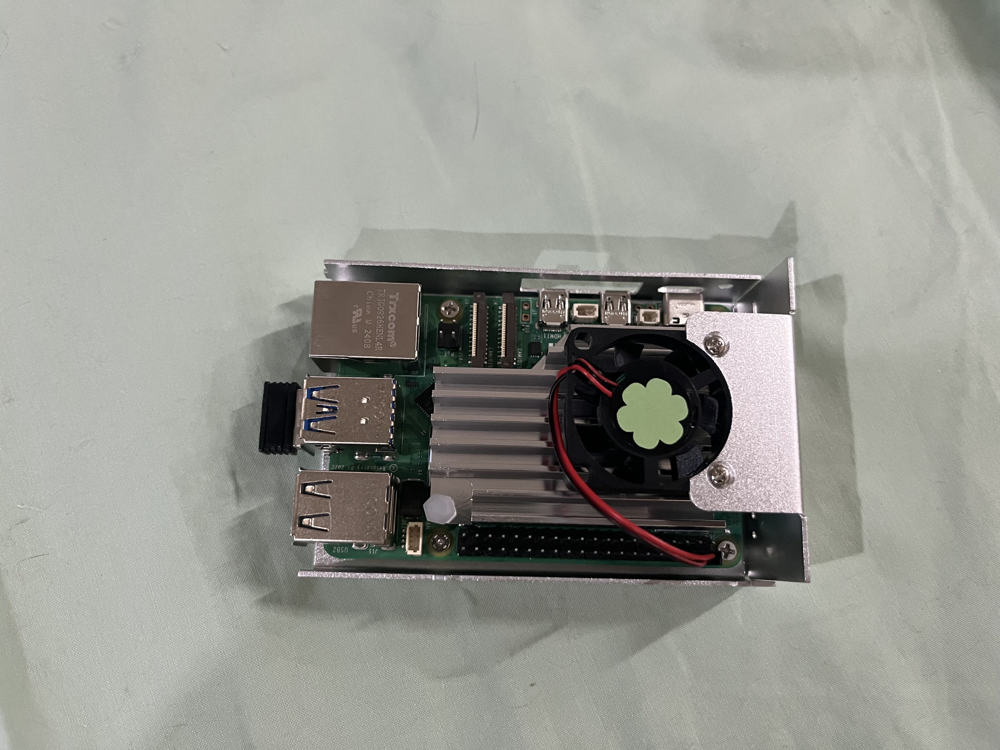
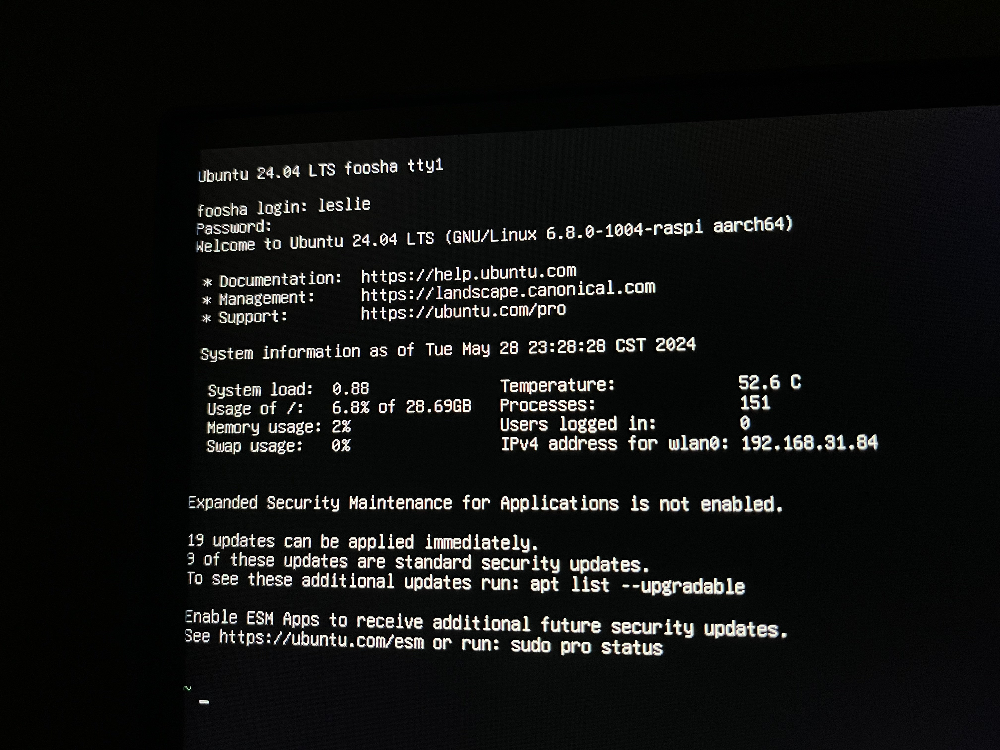

## 烧录镜像至SD卡中

1. 在[官网](https://www.raspberrypi.com/software/)下载对应系统的烧录机
2. SD卡插入读卡器，接入电脑，打开烧录机
3. 烧录镜像至SD卡中
    1. `Raspberry Pi Device`选择对应的树莓派型号，我这里使用的是`Raspberry Pi 5`
    2. 操作系统选择想要的系统就行，这里我选择的是`Ubuntu Server LTS`
    3. 储存卡选择外接的SD卡
4. 设置信息，例如登录账号、WiFi、SSH等
5. 烧录

## 开机

1. 接入电源、显示器、键鼠
2. 开机

## 关机

> 亮绿灯时，此时为读写状态，尽量不要直接断电，否则容易报废SD卡

1. 关机 `sudo shutdown`
2. 立即关机 `sudo shutdown now`
3. 重启 `sudo reboot`
4. 立即重启 `sudo reboot now`

## 安装外壳

1. 安装散热板
2. 安装下壳
3. 接通风扇电源，但不安装固定，为了测试风向
4. 接通电源，测试风向，关机
5. 固定风扇
6. 安装上壳



## zsh

1. 更新包列表
   ```bash
   sudo apt update
   ```
2. 安装zsh
   ```bash
   sudo apt install zsh
   ```
3. 安装oh my zsh
   ```bash
   # github
   sh -c "$(curl -fsSL https://raw.githubusercontent.com/ohmyzsh/ohmyzsh/master/tools/install.sh)"
   # gitee
   sh -c "$(curl -fsSL https://gitee.com/mirrors/oh-my-zsh/raw/master/tools/install.sh)"
   ```
4. 将zsh设置为默认shell
   ```bash
   chsh -s $(which zsh)
   ```
5. 检查
   ```bash
   echo $SHELL # 为 `/usr/bin/zsh` 或 `/bin/zsh` 即设置成功
   ```

## 高亮插件

1. clone插件
   ```bash
   # github
   git clone https://github.com/zsh-users/zsh-syntax-highlighting.git ${ZSH_CUSTOM:-~/.oh-my-zsh/custom}/plugins/zsh-syntax-highlighting
   # gitee
   git clone https://gitee.com/mirrors/zsh-syntax-highlighting.git ${ZSH_CUSTOM:-~/.oh-my-zsh/custom}/plugins/zsh-syntax-highlighting
   ```
2. 编辑 `~/.zshrc`
   ```bash
   vim ~/.zshrc
   # 改至 plugins=( git zsh-syntax-highlighting )
   ```
3. 重启zsh
   ```bash
   source ~/.zshrc
   ```

## 希望技术的齿轮能够转动一下


