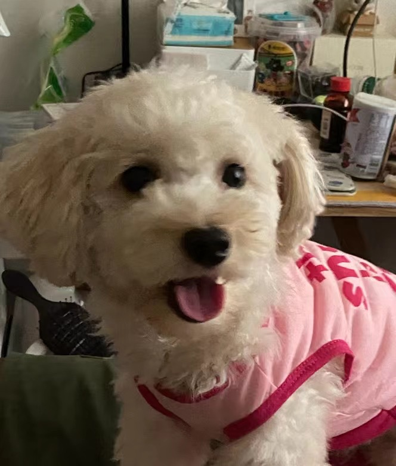
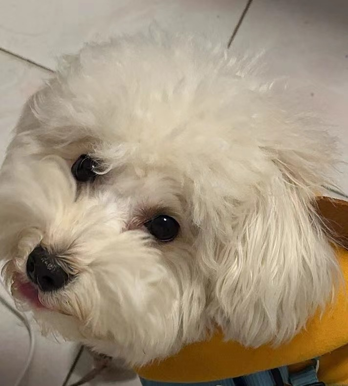

## 工作

近期工作内容相对轻松，但每天又处于相对高压的状态。在如此的大环境里，能做的只有忍气吞声与持续进度，苟到经济上行的那一天。

但我也没有很好的完成工作，鱼摸的过多了，后续要收一收了。

## 爱情

马上跟蔡宝在一起900天了，今年对爱情又有很多改变。看法、做事、规则…

今年爱情似乎比去年好了很多，我也有很直面的输出我的情绪，告诉蔡宝我的诉求，也会注意蔡宝的需求，希望将这份普通而不普通的爱情持续下去。

## 亲情

刚生完六只小狗的鼻涕的离去让我久久不嫩忘怀，而后得知几天后五个小小狗也走了，我甚至有种无力感。

我很喜欢鼻涕，但我绝对没有爸爸和小小张对它喜爱，我既如此，他们如何呢。

在网上看到一句评论，直接破防，泪如雨下。
> - 好想它 它准备什么时候再来当我的毛孩子呢
> - 它下辈子还来你家给你当宝宝

至今我没有敢问最后一只小狗怎么样了，我希望生活应该有希望，不该绝望。

> 鼻涕鼻涕游啊游，四面八方都是自由

## 经济

- 五一去岛上耍花了一笔。
- 入了两根路亚
- 日本亚马逊买了两个泳镜
- 618买了很多东西，非必需占据了大部分。

经济账是我最难缕清的一根线，今年经济OKR貌似要fail了，但还是能推进就推进吧。

记账最近也不勤快，这周要还清记账的账。

## 身体

持续一两个月的骑车、打球、游泳，高度的有氧流失了脂肪和肌肉，BMI在20左右，过低了。

后续要降低有氧的强度，每天撸撸铁，做些力量训练等无氧，提高一下肌肉密度。

## 个人

- 游泳课上完了，后续1h游了2700m，点亮了蛙泳技能点。
- 入了树莓派，后续主要学一下服务器相关，如linux、docker、集群、监控等
- 机缘巧合用react + electron搓了一个小app，后续完善这个app，先粗浅的了解一下
- webpack停滞不前，怠惰懒惰
- 总体还是相当迷茫，完全不知道路在哪里，能做的只有摸黑前行。
- 第一次以成人姿态去接触生死，目前的我很难看淡
